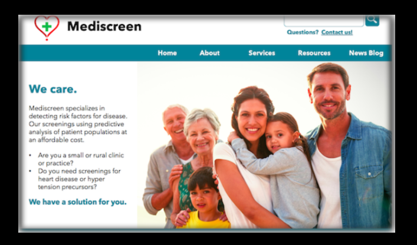

 ***  ***  *** 

<h1 align="center">Mediscreen</h1>

**Mediscreen** is a _Spring Boot web_ application with _MSA_ (MicroService Architecure) that faciliates to connect microservices with the industry's most _scalable_ and _flexible_ API Platform through recent _cross-cutting edge_ technologies.
<br>

<a href="#"></a><br>

 ### Project Domain goals:
- Provide a web app interface to users (**Health centers & Private clinics**) those who are interested in specialized information pertaining to _detection of potential risk factors_ associated _to diseases_ like diabetes.
- Provides reliable and up-to-date real-time information on the -Patients vulnerability_ to risk to diseases based on their individual _medical track records_ using a _predictive analysis_ approach with atmost accuracy.

 It is available as a web interface both on _PC & mobile platforms_ for _Abernathy clinic_ users & will be made extended to all users of different Health centers and private clinics customized to their potential goals.

 ### Key features
- Helps _maintain accurate information record_ on the Patients;
- Provides _enhanced Medical record management & maintenance_ capabilities with _better UX_ (User experience) on using the web app user nterface.
- Provides reliable and up-to-date real-time information through _Assessment Reports_ on their potential vulnerability to potential diseases based on the risk factors information persist on their medical record information.

To meet the  predictable possiblility on the anticipated explosive growth potential among the  user's client base in the health sector, the recent & modern cross-cutting edge technological integration in the architecture design has been implemented in this project to optimize performance for future high volume user demands.


## Technological Spec & Run Prerequisites

- Java 11 JDK
- Gradle 7.3
- Docker (Scalability)
- Discovery services (High availability)

## Architectural Spec:

Mediscreen application is composed of primarily 3 microservices:

- **Microservice: Patient**
- **Microservice: Notes**
- **Microservice: Assessment**
- + more complementary Microservices to enhance scalability & high availaibility features


## Application Run configuration

 <br/>
```
gradle bootRun or ./gradle bootRun
```
```
gradle bootWar or ./gradle bootWar or ./gradle bootJar
```

 <br/>

### Building Docker images

Use the **Dockerfile** on the package roots containing individual 4 services to build docker images

SYNTAX:
```
docker build . -f Dockerfile -t imageNameToBeCreated
```

### Running a Docker image

Use the  **DockerImage** created above & run a Docker image using the command below

SYNTAX:
```
docker run -d -p HostPort:InternalAppPort --name dockerContainerNameToBeCreated -d DockerImageName
```

### Docker Compose

In case, if want to use an automated multi-container workflow with docker-compose, follow details below:

To deploy all Mediscreen microservices in a single go, use the **docker-compose.yml** on the package root containing all services that will orchestrate multiple containers wherein it will make it to work together based on the defined configuration in it. (Feel free to change the configuration settings for you required workflow)

SYNTAX:
```
docker-compose up -d
```

## Testing

Gradle, Junit (Unit & Integration Tests). <br/>

SYNTAX:
```
gradlew test or ./gradlew test or gradlew clean test
```


## Reporting

 ### Test Results <br/>

//TODO


# Metrics

//TODO

## API (Endpoints) documentation 

All endpoints are documented with POSTMAN and can be accessed launched with the below link to POSTMAN:

[POSTMAN - Mediscreen APIs](#)<br><br><br>


## SPRINT Backlog documentation (KANBAN @notion.io)

All SPRINT progress are documented with Notion.io and reported in the link below:

[SPRINT progress documentation for this project](readme_docs/kanban_progressline_report/kanban_readme.md)

[NOTION - Backlog Online - Link](https://www.notion.so/411c45a75ebd41848f20816d5a1b023d?v=4fbc0f2adb024e93aea0306e875a9419)


## SPRINT Retrospective documentation

All SPRINT Retrospectives are documented reported here in the link below:

[SPRINT Retrospectives documentation for this project](https://github.com/selvaradjousk/Mediscreen/tree/develop/readme_docs/retrospectives)<br>
<br>
[SPRINT Retrospectives readme documentation for this project](https://github.com/selvaradjousk/Mediscreen/blob/develop/readme_docs/retrospectives/retro_readme.md)<br>
<br>


## SPRINT Tasks timeline progress documentation

All Tasks timeline progress are documented and reported here in the link below:

[Tasks Timeline progress documentation](https://github.com/selvaradjousk/Mediscreen/commits/develop/readme_docs/project_progress_tracker.txt)<br>


### Authors
Mentee:  🡆   @Senthil<br>
Mentor:  🡆   Clément SEZETTRE<br><br>

### versions
Version:  🡆 1.0<br><br>

### License
@OpenClassrooms & @Mediscreen<br><br>


Reference Documentation
===
For further reference, consider the following sections:


* [Spring Web](https://docs.spring.io/spring-boot/docs/2.5.4/reference/htmlsingle/#boot-features-developing-web-applications)
* [Docker docs](https://docs.docker.com/)
* [Gradle User Manual](https://docs.gradle.org/current/userguide/userguide.html)
* [STAN DOCUMENTATION WHITE PAPER](http://stan4j.com/papers/stan-whitepaper.pdf) 


Reference Guides
===
The following guides illustrate how to use some features concretely:

* [Building a RESTful Web Service with Spring Boot Actuator](https://spring.io/guides/gs/actuator-service/)
* [Securing a Web Application](https://spring.io/guides/gs/securing-web/)
* [Building a RESTful Web Service](https://spring.io/guides/gs/rest-service/)
* [Serving Web Content with Spring MVC](https://spring.io/guides/gs/serving-web-content/)
* [Building REST services with Spring](https://spring.io/guides/tutorials/bookmarks/)
* [STAN Structure Analysis for Java](http://stan4j.com/)