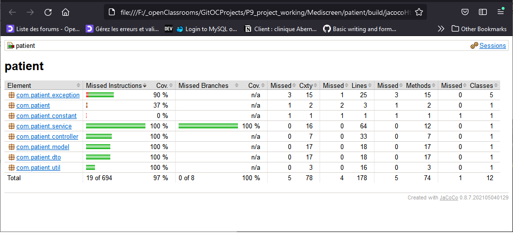
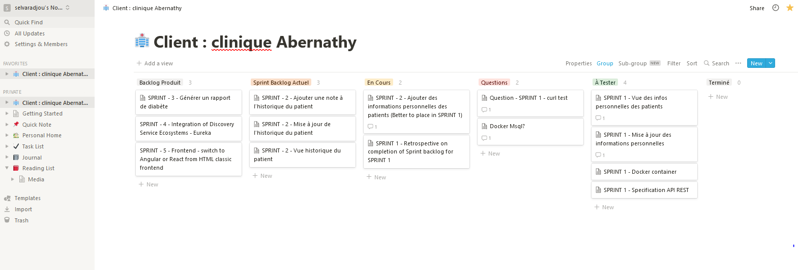
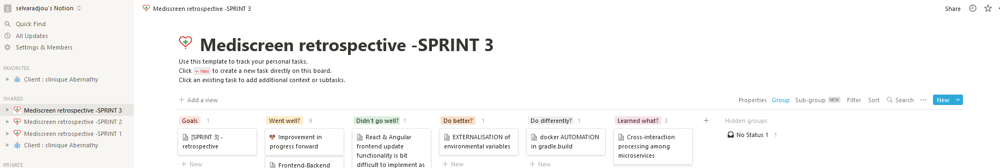

 ***  ***  *** 
<br><br><br>
<h1 align="center">Mediscreen - Patient Microservice</h1><br><br>

**Mediscreen - Patient Microservice** is developed with _Spring Boot adopting  _MVA_ design pattern and Test Design Approach (TDD).<br><br>
<br>

<a href="#"></a><br>
<br><br>

### SPRINT I - goals:

- Develop (**CRUD functionalities**) to the patient microservice to establish up the records on the fundamental personal information of the patients for the application serving the patient management requirements of clinics and health centers.<br><br>

### SPRINT I - tasks

- :heavy_check_mark: Implement CRUD functions (PATIENTS) - GET LIST, GET by ID,  GET LIST by keyword (search), ADD, UPDATE, DELETE;
- :heavy_check_mark: Implement validation for CRUD functions.
- :heavy_check_mark: Implement Mysql database & establish connection configurations to the microservice.
- :heavy_check_mark: Dependencies management, tests & test reports generation configurations using GRADLE build tool.
- :heavy_check_mark: Implement Dockerfile & docker-compose for patient microservice.
- :heavy_check_mark: API documentation in support to the user stories & user test cases.
- :heavy_check_mark: Integration of backend with basic frontend like Thymeleaf.
- :heavy_check_mark: Agile KANBAN update of the sprint progress tracking (start date, anticipated deadline, completion date, tasks, task status...)
- :heavy_check_mark: Retrospective update at the end of each SPRINT
<br><br>

## Technological Spec & Run Prerequisites

- Java 11 JDK
- Gradle 7.3
- Docker 
- Mysql DB
<br><br><br>

## Architectural Spec - Microservice - Patient:

### Schema MVC

<a href="#"></a><br>
<br><br><br>


### Schema MCD

<a href="#"></a><br>
<br><br><br>


## Application Run configuration

 <br/>

```
gradle bootRun or ./gradle bootRun
```
```
gradle bootWar or ./gradle bootWar or ./gradle bootJar
```

<br><br>

 <br/>

### Building Docker images

Use the **Dockerfile** on the package roots containing individual 4 services to build docker images

SYNTAX:

```
docker build . -f Dockerfile -t imageNameToBeCreated
```

### Running a Docker image

Use the  **DockerImage** created above & run a Docker image using the command below

SYNTAX:

```
docker run -d -p HostPort:InternalAppPort --name dockerContainerNameToBeCreated -d DockerImageName
```

### Docker Compose

In case, if want to use an automated multi-container workflow with docker-compose, follow details below:

To deploy all Mediscreen microservices in a single go, use the **docker-compose.yml** on the package root containing all services that will orchestrate multiple containers wherein it will make it to work together based on the defined configuration in it. (Feel free to change the configuration settings for you required workflow)

SYNTAX:

```
docker-compose up -d
```
<br><br>

### Trouble shooting - MySql configuration inside Docker container

In case of problems in the configuration of entrypoint injection of DB creation and data insertion in Mysql container

```
-- Execute the container for mysql and follow the steps below:
sudo docker exec -it mysql_db /bin/bash
```

```
mysql -uroot -p
password: 
-- Enter your password or in this case of the project use the following one -> 'password'
```
 


```
--  check for the username: mediuser entry is created in the mysql database and grant privilages are ok
use mysql;
SELECT user, host FROM user;
-- if not created, create one as below and provide grant privilages as below:
CREATE USER 'mediuser'@'localhost' IDENTIFIED BY 'password';
GRANT ALL PRIVILEGES ON * . * TO 'mediuser'@'localhost';
GRANT ALL PRIVILEGES ON *.* TO 'root'@'localhost';

-- check if all is set ok for username: mediuser
SELECT user, host FROM user;

-- now check for database: mediscreendb defined in docker-compose and application.properties are created
show databases;
-- if not present create one

-- if database is present, now check for the table: patients
use mediscreendb;
show tables;

```

```
-- in case need to populate the database with patients dataset you can use sql scripts or commands as below:

INSERT INTO `patients` (`address`, `date_of_birth`, `first_name`, `last_name`, `phone_number`, `sex`) VALUES ('1 Brookside St', '1966-12-31', 'Test', 'TestNone', '100-222-3333', 'F');
INSERT INTO `patients` (`address`, `date_of_birth`, `first_name`, `last_name`, `phone_number`, `sex`) VALUES ('2 High St', '1945-06-24', 'Test', 'TestBorderline', '200-333-4444', 'M');
INSERT INTO `patients` (`address`, `date_of_birth`, `first_name`, `last_name`, `phone_number`, `sex`) VALUES ('3 Club Road', '2004-06-18', 'Test', 'TestInDanger', '300-444-5555', 'M');
INSERT INTO `patients` (`address`, `date_of_birth`, `first_name`, `last_name`, `phone_number`, `sex`) VALUES ('4 Valley Dr', '2004-06-18', 'Test', 'TestEarlyOnset', '400-555-6666', 'F');
INSERT INTO `patients` (`address`, `date_of_birth`, `first_name`, `last_name`, `phone_number`, `sex`) VALUES ('NOWHERE', '2000-01-01', 'NONE', 'NOONE', '11111111', 'M');
INSERT INTO `patients` (`address`, `date_of_birth`, `first_name`, `last_name`, `phone_number`, `sex`) VALUES ('1202 Bumble Dr', '1959-06-28', 'Piers', 'Bailey', '747-815-0557', 'M');
INSERT INTO `patients` (`address`, `date_of_birth`, `first_name`, `last_name`, `phone_number`, `sex`) VALUES ('12 Beechwood Road', '1964-06-18', 'Natalie', 'Clark', '241-467-9197', 'F') ;
INSERT INTO `patients` (`address`, `date_of_birth`, `first_name`, `last_name`, `phone_number`, `sex`) VALUES ('193 Vale St', '1945-06-24', 'Max', 'Buckland', '833-534-0864', 'M') ;
INSERT INTO `patients` (`address`, `date_of_birth`, `first_name`, `last_name`, `phone_number`, `sex`) VALUES ('12 Cobblestone St', '1966-12-31', 'Claire', 'Wilson', '300-452-1091', 'F') ;
INSERT INTO `patients` (`address`, `date_of_birth`, `first_name`, `last_name`, `phone_number`, `sex`) VALUES ('40 Sulphur Springs Dr', '1949-12-07', 'Tracey', 'Ross', '131-396-5049', 'F') ;
INSERT INTO `patients` (`address`, `date_of_birth`, `first_name`, `last_name`, `phone_number`, `sex`) VALUES ('4 Southampton Road', '1958-06-29', 'Wendy', 'Ince', '802-911-9975', 'F') ;
INSERT INTO `patients` (`address`, `date_of_birth`, `first_name`, `last_name`, `phone_number`, `sex`) VALUES ('894 Hall Street', '1946-11-26', 'Anthony', 'Sharp', '451-761-8383', 'M') ;
INSERT INTO `patients` (`address`, `date_of_birth`, `first_name`, `last_name`, `phone_number`, `sex`) VALUES ('599 East Garden Ave', '1952-11-11', 'Edward', 'Arnold', '123-727-2779', 'M') ;
INSERT INTO `patients` (`address`, `date_of_birth`, `first_name`, `last_name`, `phone_number`, `sex`) VALUES ('745 West Valley Farms Drive', '1952-09-27', 'Pippa', 'Rees', '628-423-0993', 'F') ;
INSERT INTO `patients` (`address`, `date_of_birth`, `first_name`, `last_name`, `phone_number`, `sex`) VALUES ('2 Warren Street', '2021-06-22', 'Lucas', 'Ferguson', '387-866-1399', 'M') ;

```
<br><br>


## Testing

Gradle, Junit (Unit & Integration Tests). <br/>

SYNTAX:

```
gradlew test or ./gradlew test or gradlew clean test
```

<br>

#### CURL TESTS TO ADD PATIENT:

```
curl --location --request POST 'http://localhost:8081/patient/add' --header 'Content-Type: application/json' --data-raw 
'{
    "lastName": "TestNone",
    "firstName": "Test",
    "birthDate": "1966-12-31",
    "sex": "F",
    "address": "1 Brookside St",
    "phoneNumber": "100-222-3333"
}'
```

```
curl --location --request POST 'http://localhost:8081/patient/add' --header 'Content-Type: application/json' --data-raw 
'{
    "lastName": "TestBorderline",
    "firstName": "Test",
    "birthDate": "1945-06-24",
    "sex": "M",
    "address": "2 High St",
    "phoneNumber": "00-333-4444"
}'
```

```
curl --location --request POST 'http://localhost:8081/patient/add' --header 'Content-Type: application/json' --data-raw 
'{
    "lastName": "TestInDanger",
    "firstName": "Test",
    "birthDate": "2004-06-18",
    "sex": "M",
    "address": "3 Club Road",
    "phoneNumber": "300-444-5555"
}'
```

```
curl --location --request POST 'http://localhost:8081/patient/add' --header 'Content-Type: application/json' --data-raw 
'{
    "lastName": "TestEarlyOnset",
    "firstName": "Test",
    "birthDate": "2002-06-28",
    "sex": "F",
    "address": "4 Valley Dr",
    "phoneNumber": "400-555-6666"
}'
```
<br>

#### CURL - GET PATIENT LIST:

```
curl --location --request GET 'http://localhost:8081/patient/list'
```

#### CURL - GET PATIENT BY ID:

```
curl --location --request GET 'http://localhost:8081/patient/get/1'
```

#### CURL - GET PATIENT BY LAST NAME:

```
curl --location --request GET 'http://localhost:8081/patient/getByFamilyName?lastName=Clark'
```

#### CURL - DELETE PATIENT BY ID:

```
curl --location --request GET 'http://localhost:8081/patient/delete/1'
```


#### CURL - UPDATE PATIENT:

```
curl --location --request POST 'http://localhost:8081/patient/update/1' --header 'Content-Type: application/json' --data-raw 
'{
    "lastName": "TestNone",
    "firstName": "Test",
    "birthDate": "1966-12-31",
    "sex": "F",
    "address": "1 Brookside St - UPDATED",
    "phoneNumber": "100-222-3333"
}'
```
<br>


<br>

### JaCoCo coverage

<a href="#"></a><br>
<br>
<br>


### Gradle

<a href="#"></a><br>
<br>
<br>


### Junit 

<a href="#"></a><br>
<br>
<br>


# Metrics


### Tests distribution - (Unit Tests & Integration Tests)

<a href="#"></a><br>
<br>
<br>


## UI - UX frontend - Thymeleaf  


### Patients listing - GET http://localhost:8081/patient/list

<a href="#"></a><br>
<br><br>


### Patients list search keyword - GET http://localhost:8080/patient/list?keyword=testNone

<a href="#"></a><br>
<br><br>


### Patients add - GET http://localhost:8080/patient/add

<a href="#"></a><br>
<br><br>


### Patients POST validate - POST http://localhost:8080/patient/validate

<a href="#"></a><br>
<br><br>


### Patients POST update - POST http://localhost:8081/patient/update

<a href="#"></a><br>
<br><br>


### Patients POST update validation - POST http://localhost:8080/patient/update

<a href="#"></a><br>
<br><br>


## UI - UX frontend - Angular  


### Patients Home - GET http://localhost:4200/

<a href="#"></a><br>
<br><br>


### Patients listing - GET http://localhost:4200/patients

<a href="#"></a><br>
<br><br>


### Patients add - http://localhost:4200/add-patient

<a href="#"></a><br>
<br><br>


## UI - UX frontend - React js  


### Patients Home - GET http://localhost:3000/

<a href="#"></a><br>
<br><br>


### Patients listing - http://localhost:3000/patient/list

<a href="#"></a><br>
<br><br>


### Patients add - http://localhost:3000/add-patient

<a href="#"></a><br>
<br><br>


## API (Endpoints) documentation 

All endpoints are documented with POSTMAN and can be accessed launched with the below link to POSTMAN:


## SPRINT Backlog documentation (KANBAN @notion.io)

All SPRINT progress are documented with Notion.io and reported in the link below:

### SPRINT I - startline

<a href="#"></a><br>
<br><br>

### SPRINT I - completion

<a href="#"></a><br>
<br><br>


[SPRINT progress documentation for this project](readme_docs/kanban_progressline_report/kanban_readme.md)

[NOTION - Backlog Online - Link](https://www.notion.so/411c45a75ebd41848f20816d5a1b023d?v=4fbc0f2adb024e93aea0306e875a9419)

<br><br>

<a href="https://www.notion.so/411c45a75ebd41848f20816d5a1b023d?v=4fbc0f2adb024e93aea0306e875a9419"></a><br>


## SPRINT Retrospective documentation

All SPRINT Retrospectives are documented reported here in the link below:

[SPRINT Retrospectives documentation for this project](https://github.com/selvaradjousk/Mediscreen/tree/develop/readme_docs/retrospectives)<br>
<br><br>
[SPRINT Retrospectives readme documentation for this project](https://github.com/selvaradjousk/Mediscreen/blob/develop/readme_docs/retrospectives/retro_readme.md)<br>
<br><br>

### SPRINT I - Retrospective

<a href="#"></a><br>
<br><br>


### SPRINT on Project Completion - Link below

<a href="https://www.notion.so/45e050d53f5d4e658660aef938390baf?v=38e546393141444596b10d2bcb8f7d82"></a><br>
<br><br>


## SPRINT Tasks timeline progress documentation

All Tasks timeline progress are documented and reported here in the link below:

[Tasks Timeline progress documentation](https://github.com/selvaradjousk/Mediscreen/commits/develop/readme_docs/project_progress_tracker.txt)<br>
<br><br>

### Authors
Mentee:  🡆   @Senthil<br>
Mentor:  🡆   Clément SEZETTRE<br><br>

<a href="https://www.linkedin.com/in/selvaradjou-senthil-kumar-6684131b3/"></a>&nbsp;&nbsp;
<a href="https://www.linkedin.com/in/sezettreclement/"></a>
<br>
<br>

### versions
Version:  🡆 1.0<br><br>

### License
@OpenClassrooms & @Mediscreen<br><br>
<a href="https://openclassrooms.com"></a><br>
<br><br>


Reference Documentation
===
For further reference, consider the following sections:


* [Spring Web](https://docs.spring.io/spring-boot/docs/2.5.4/reference/htmlsingle/#boot-features-developing-web-applications)
* [Docker docs](https://docs.docker.com/)
* [Gradle User Manual](https://docs.gradle.org/current/userguide/userguide.html)
* [STAN DOCUMENTATION WHITE PAPER](http://stan4j.com/papers/stan-whitepaper.pdf) 

<br><br>

Reference Guides
===
The following guides illustrate how to use some features concretely:

* [Building a RESTful Web Service with Spring Boot Actuator](https://spring.io/guides/gs/actuator-service/)
* [Securing a Web Application](https://spring.io/guides/gs/securing-web/)
* [Building a RESTful Web Service](https://spring.io/guides/gs/rest-service/)
* [Serving Web Content with Spring MVC](https://spring.io/guides/gs/serving-web-content/)
* [Building REST services with Spring](https://spring.io/guides/tutorials/bookmarks/)
* [STAN Structure Analysis for Java](http://stan4j.com/)