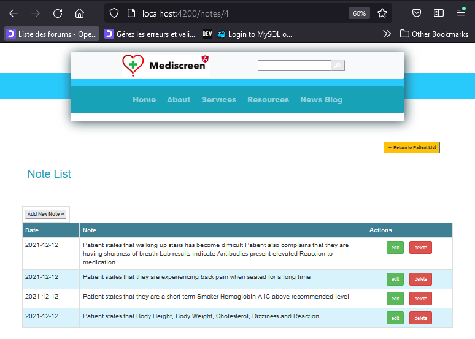

 ***  ***  *** 
<br><br><br>
<h1 align="center">Mediscreen - Patient History Microservice</h1><br><br>

**Mediscreen - Patient History Microservice** is developed with _Spring Boot adopting  _MVA_ design pattern and Test Design Approach (TDD).<br><br>
<br>

<a href="#"></a><br>
<br><br>

### Sprint II - goals:
- Develop (**CRUD functionalities**) to the patientHistory microservice to establish the medical records (patient visit notes) on the medical history of the patients for the application to serve the global patient management service of clinics and health centers.<br><br>

### SPRINT II - tasks
- :heavy_check_mark: Implement CRUD functions (PATIENT HISTORY - note) - GET LIST by patient id, GET by noteId, ADD, UPDATE, DELETE;
- :heavy_check_mark: Implement validation for CRUD functions.
- :heavy_check_mark: Implement NoSQL database - MongoDB & establish connection configurations to the microservice.
- :heavy_check_mark: Dependencies management, tests & test reports generation configurations using GRADLE build tool.
- :heavy_check_mark: Implement Dockerfile & docker-compose for patient history (note) microservice.
- :heavy_check_mark: API documentation in support to the user stories & user test cases.
- :heavy_check_mark: Integration of backend with basic frontend like Thymeleaf.
- :heavy_check_mark: Agile KANBAN update of the sprint progress tracking (start date, anticipated deadline, completion date, tasks, task status...)
- :heavy_check_mark: Retrospective update at the end of each SPRINT
<br><br>

## Technological Spec & Run Prerequisites

- Java 11 JDK
- Gradle 7.3
- Docker 
-MongoDB
<br><br><br>

## Architectural Spec - Microservice - Patient History:

### Schema MVC

<a href="#"></a><br>
<br><br><br>


### Schema MCD

<a href="#"></a><br>
<br><br><br>


## Application Run configuration

 <br/>

```
gradle bootRun or ./gradle bootRun
```
```
gradle bootWar or ./gradle bootWar or ./gradle bootJar
```

<br><br>

 <br/>

### Building Docker images

Use the **Dockerfile** on the package roots containing individual 4 services to build docker images

SYNTAX:

```
docker build . -f Dockerfile -t imageNameToBeCreated
```

### Running a Docker image

Use the  **DockerImage** created above & run a Docker image using the command below

SYNTAX:

```
docker run -d -p HostPort:InternalAppPort --name dockerContainerNameToBeCreated -d DockerImageName
```

### Docker Compose

In case, if want to use an automated multi-container workflow with docker-compose, follow details below:

To deploy all Mediscreen microservices in a single go, use the **docker-compose.yml** on the package root containing all services that will orchestrate multiple containers wherein it will make it to work together based on the defined configuration in it. (Feel free to change the configuration settings for you required workflow)

SYNTAX:

```
docker-compose up -d
```
<br><br>

### Trouble shooting - Mongo DB configuration inside Docker container

In case of problems in the configuration of entrypoint injection of DB creation and data insertion in mongodb container

```
# Execute the container for mongo DB and follow the steps below:
sudo docker exec -it mongodb /bin/bash

```

```
mongo
```
 


```

-- now check for database: mediscreendb defined in docker-compose and application.properties are created
show dbs
-- if not present create one
use mediscreendb

-- if database is present, now check for the table: notes
show collections

-- if absent, create table as below:
db.createCollection("notes")

```

```
-- check if the table has data entries with below command:
db.notes.find().pretty()

-- in case need to populate the database with notes dataset you can use json file available in folder docker_db/mongodb/init/init_db_prod.json or run commands as below:

db.notes.insertMany(
[
 	{
 		"patientId" : 1,
		"date" : "12-12-2021 01:01:01",
		"note" : "Patient states that they are 'feeling terrific' Weight at or below recommended level",
	},
 	{
 		"patientId" : 2,
		"date" : "12-12-2021 01:01:01",
		"note" : "Patient states that they are feeling a great deal of stress at work Patient also complains that their hearing seems Abnormal as of late",
	},
 	{
 		"patientId" : 2,
		"date" : "12-12-2021 01:01:01",
		"note" : "Patient states that they have had a Reaction to medication within last 3 months Patient also complains that their hearing continues to be problematic",
	},
 	{
 		"patientId" : 3,
		"date" : "12-12-2021 01:01:01",
		"note" : "Patient states that they are short term Smoker",
	},
 	{
 		"patientId" : 3,
		"date" : "12-12-2021 01:01:01",
		"note" : "Patient states that they quit within last year Patient also complains that of Abnormal breathing spells Lab reports Cholesterol LDL high",
	},
 	{
 		"patientId" : 4,
		"date" : "12-12-2021 01:01:01",
		"note" : "Patient states that walking up stairs has become difficult Patient also complains that they are having shortness of breath Lab results indicate Antibodies present elevated Reaction to medication",
	},
 	{
 		"patientId" : 4,
		"date" : "12-12-2021 01:01:01",
		"note" : "Patient states that they are experiencing back pain when seated for a long time",
	},
 	{
 		"patientId" : 4,
		"date" : "12-12-2021 01:01:01",
		"note" : "Patient states that they are a short term Smoker Hemoglobin A1C above recommended level",
	},
 	{
 		"patientId" : 4,
		"date" : "12-12-2021 01:01:01",
		"note" : "Patient states that Body Height, Body Weight, Cholesterol, Dizziness and Reaction",
	},
]
)

```

<br><br>


## Testing

Gradle, Junit (Unit & Integration Tests). <br/>

SYNTAX:

```
gradlew test or ./gradlew test or gradlew clean test
```

<br>

#### CURL TESTS TO ADD PATIENT:

```
curl --location --request POST 'http://localhost:8082/note/add' --header 'Content-Type: text/plain' --data-raw 
'{
    "patientId": 1,
     "date": "2021-12-12",
    "note": "Patient states that they are '\''feeling terrific'\'' Weight at or below recommended level"
}'
```

```
curl --location --request POST 'http://localhost:8082/note/add' --header 'Content-Type: application/json' --data-raw 
'{
    "patientId": 2,
     "date": "2021-12-12",
    "note": "Patient states that they are feeling a great deal of stress at work Patient also complains that their hearing seems Abnormal as of late"
}'
```

```
curl --location --request POST 'http://localhost:8082/note/add' --header 'Content-Type: application/json' --data-raw 
'{
    "patientId": 2,
     "date": "2021-12-12",
    "note": "Patient states that they have had a Reaction to medication within last 3 months Patient also complains that their hearing continues to be problematic"
}'
```

```
curl --location --request POST 'http://localhost:8082/note/add' --header 'Content-Type: application/json' --data-raw 
'{
    "patientId": 3,
     "date": "2021-12-12",
    "note": "Patient states that they quit within last year Patient also complains that of Abnormal breathing spells Lab reports Cholesterol LDL high"
}'
```

```
curl --location --request POST 'http://localhost:8082/note/add' --header 'Content-Type: application/json' --data-raw 
'{
    "patientId": 3,
     "date": "2021-12-12",
    "note": "Patient states that they are short term Smoker"
}'
```

```
curl --location --request POST 'http://localhost:8082/note/add' --header 'Content-Type: application/json' --data-raw 
'{
    "patientId": 4,
     "date": "2021-12-12",
    "note": "Patient states that walking up stairs has become difficult Patient also complains that they are having shortness of breath Lab results indicate Antibodies present elevated Reaction to medication"
}'
```


```
curl --location --request POST 'http://localhost:8082/note/add' --header 'Content-Type: application/json' --data-raw 
'{
    "patientId": 4,
     "date": "2021-12-12",
    "note": "Patient states that they are experiencing back pain when seated for a long time"
}'
```


```
curl --location --request POST 'http://localhost:8082/note/add' --header 'Content-Type: application/json' --data-raw 
'{
    "patientId": 4,
     "date": "2021-12-12",
    "note": "Patient states that they are a short term Smoker Hemoglobin A1C above recommended level"
}'
```


<br>

#### CURL - GET NOTE LIST FOR a PATIENT ID:

```
curl --location --request GET 'http://localhost:8082/note/list/1'
```

#### CURL - GET NOTE BY ID:

```
curl --location --request GET 'http://localhost:8082/note/get/61ec5b9b7a24ea477778ea5f'
-- this above curl with noteId is an example where the id generated in other host will be different. It should be referenced to the collection in the mongodb in investigation.
```

#### CURL - DELETE NOTE BY ID:

```
curl --location --request GET 'http://localhost:8082/note/delete/61d5c2089a1f0726efee51a6'
```


#### CURL - ADD NOTE:

```
curl --location --request POST 'http://localhost:8082/note/add' --header 'Content-Type: application/json' --data-raw 
'{
    "patientId": 1,
     "date": "2021-12-12",
    "note": "Patient states that they are '\''feeling terrific'\'' Weight at or below recommended level"
}'
```


#### CURL - ADD NOTE:

```
curl --location --request POST 'http://localhost:8082/note/update/61d5c2089a1f0726efee51a6' --header 'Content-Type: application/json' --data-raw 
'{
    "patientId": 1,
     "date": "2021-12-12",
    "note": "Patient states that they are '\''feeling terrific'\'' Weight at or below recommended level. UPDATE TESTING"
}'
```

<br>


<br>

### JaCoCo coverage

<a href="#"></a><br>
<br>
<br>


### Gradle

<a href="#"></a><br>
<br>
<br>


### Junit 

<a href="#"></a><br>
<br>
<br>


# Metrics


### Tests distribution - (Unit Tests & Integration Tests)

<a href="#"></a><br>
<br>
<br>


## UI - UX frontend - Thymeleaf  


### Notes listing of patient - GET http://localhost:8080/note/list/4

<a href="#"></a><br>
<br><br>


### note add - POST http://localhost:8080/note/add/4

<a href="#"></a><br>
<br><br>


### note update - POST http://localhost:8080/note/update/61d5d9849a1f0726efee51b5

<a href="#"></a><br>
<br><br>


## UI - UX frontend - Angular  


### Patients listing - GET http://localhost:4200/notes/4

<a href="#"></a><br>
<br><br>


### Note add - POST http://localhost:4200/add-note/4

<a href="#"></a><br>
<br><br>


### Note update -POST  http://localhost:4200/note-edit/4/61d5d9849a1f0726efee51b5

<a href="#"></a><br>
<br><br>


## UI - UX frontend - React js  


### Notes listing - GET http://localhost:3000/list-note/4

<a href="#"></a><br>
<br><br>


### Note update POST - http://localhost:3000/edit-note/4/61d5d9849a1f0726efee51b5

<a href="#"></a><br>
<br><br>


## API (Endpoints) documentation 

All endpoints are documented with POSTMAN and can be accessed launched with the below link to POSTMAN:


## SPRINT Backlog documentation (KANBAN @notion.io)

All SPRINT progress are documented with Notion.io and reported in the link below:


### SPRINT II 

<a href="#"></a><br>
<br><br>


[SPRINT progress documentation for this project](readme_docs/kanban_progressline_report/kanban_readme.md)

[NOTION - Backlog Online - Link](https://www.notion.so/411c45a75ebd41848f20816d5a1b023d?v=4fbc0f2adb024e93aea0306e875a9419)

<br><br>

<a href="https://www.notion.so/411c45a75ebd41848f20816d5a1b023d?v=4fbc0f2adb024e93aea0306e875a9419"></a><br>


## SPRINT Retrospective documentation

All SPRINT Retrospectives are documented reported here in the link below:

[SPRINT Retrospectives documentation for this project](https://github.com/selvaradjousk/Mediscreen/tree/develop/readme_docs/retrospectives)<br>
<br><br>
[SPRINT Retrospectives readme documentation for this project](https://github.com/selvaradjousk/Mediscreen/blob/develop/readme_docs/retrospectives/retro_readme.md)<br>
<br><br>

### SPRINT II - Retrospective

<a href="#"></a><br>
<br><br>


### SPRINT on Project Completion - Link below

<a href="https://www.notion.so/45e050d53f5d4e658660aef938390baf?v=38e546393141444596b10d2bcb8f7d82"></a><br>
<br><br>


## SPRINT Tasks timeline progress documentation

All Tasks timeline progress are documented and reported here in the link below:

[Tasks Timeline progress documentation](https://github.com/selvaradjousk/Mediscreen/commits/develop/readme_docs/project_progress_tracker.txt)<br>
<br><br>

### Authors
Mentee:  🡆   @Senthil<br>
Mentor:  🡆   Clément SEZETTRE<br><br>

<a href="https://www.linkedin.com/in/selvaradjou-senthil-kumar-6684131b3/"></a>&nbsp;&nbsp;
<a href="https://www.linkedin.com/in/sezettreclement/"></a>
<br>
<br>

### versions
Version:  🡆 1.0<br><br>

### License
@OpenClassrooms & @Mediscreen<br><br>
<a href="https://openclassrooms.com"></a><br>
<br><br>


### Reference Documentation
For further reference, please consider the following sections:

* [Official Gradle documentation](https://docs.gradle.org)
* [Spring Boot Gradle Plugin Reference Guide](https://docs.spring.io/spring-boot/docs/2.6.2/gradle-plugin/reference/html/)
* [Create an OCI image](https://docs.spring.io/spring-boot/docs/2.6.2/gradle-plugin/reference/html/#build-image)
* [Spring Boot DevTools](https://docs.spring.io/spring-boot/docs/2.6.2/reference/htmlsingle/#using-boot-devtools)
* [Validation](https://docs.spring.io/spring-boot/docs/2.6.2/reference/htmlsingle/#boot-features-validation)
* [Spring Data MongoDB](https://docs.spring.io/spring-boot/docs/2.6.2/reference/htmlsingle/#boot-features-mongodb)
* [Spring Boot Actuator](https://docs.spring.io/spring-boot/docs/2.6.2/reference/htmlsingle/#production-ready)
* [Spring Data JPA](https://docs.spring.io/spring-boot/docs/2.6.2/reference/htmlsingle/#boot-features-jpa-and-spring-data)
* [Rest Repositories](https://docs.spring.io/spring-boot/docs/2.6.2/reference/htmlsingle/#howto-use-exposing-spring-data-repositories-rest-endpoint)

* [Spring Web](https://docs.spring.io/spring-boot/docs/2.5.4/reference/htmlsingle/#boot-features-developing-web-applications)
* [Docker docs](https://docs.docker.com/)
* [Gradle User Manual](https://docs.gradle.org/current/userguide/userguide.html)
* [STAN DOCUMENTATION WHITE PAPER](http://stan4j.com/papers/stan-whitepaper.pdf) 


### Guides
The following guides illustrate how to use some features concretely:

* [Accessing Data with MongoDB](https://spring.io/guides/gs/accessing-data-mongodb/)
* [Building a RESTful Web Service with Spring Boot Actuator](https://spring.io/guides/gs/actuator-service/)
* [Accessing Data with JPA](https://spring.io/guides/gs/accessing-data-jpa/)
* [Accessing JPA Data with REST](https://spring.io/guides/gs/accessing-data-rest/)
* [Accessing Neo4j Data with REST](https://spring.io/guides/gs/accessing-neo4j-data-rest/)
* [Accessing MongoDB Data with REST](https://spring.io/guides/gs/accessing-mongodb-data-rest/)

* [Securing a Web Application](https://spring.io/guides/gs/securing-web/)
* [Building a RESTful Web Service](https://spring.io/guides/gs/rest-service/)
* [Serving Web Content with Spring MVC](https://spring.io/guides/gs/serving-web-content/)
* [Building REST services with Spring](https://spring.io/guides/tutorials/bookmarks/)
* [STAN Structure Analysis for Java](http://stan4j.com/)

### Additional Links
These additional references should also help you:

* [Gradle Build Scans – insights for your project's build](https://scans.gradle.com#gradle)

