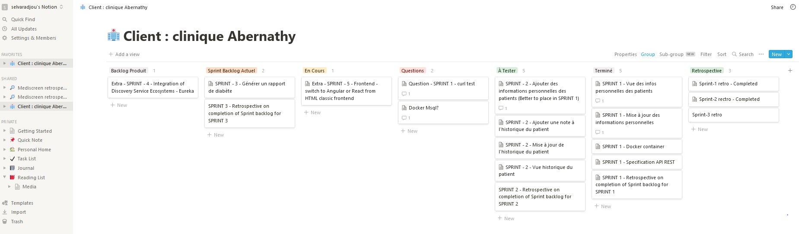

 ***  ***  *** 

<h1 align="center">Mediscreen - KANBAN SprintBacklog Progress Report</h1>

**Mediscreen** is a _Spring Boot web_ application with _MSA_ (MicroService Architecure) that faciliates to connect microservices with the industry's most _scalable_ and _flexible_ API Platform through recent _cross-cutting edge_ technologies.
 
 
 

 ### Progress status: 09-01-2022 - SPRINT 2

 

 

 ### Progress status: 31-12-2021 - SPRINT 1

 

 

 ### Progress status: STARTLINE -  28-12-2021

 

 

### Authors
Mentee:  🡆   @Senthil 
Mentor:  🡆   Clément SEZETTRE  

### versions
Version:  🡆 1.0  

### License
@OpenClassrooms & @Mediscreen  

Reference Documentation
===
For further reference, consider the following sections:

* [Spring Web](https://docs.spring.io/spring-boot/docs/2.5.4/reference/htmlsingle/#boot-features-developing-web-applications)
* [Docker docs](https://docs.docker.com/)
* [Gradle User Manual](https://docs.gradle.org/current/userguide/userguide.html)
* [STAN DOCUMENTATION WHITE PAPER](http://stan4j.com/papers/stan-whitepaper.pdf) 

Reference Guides
===
The following guides illustrate how to use some features concretely:

* [Building a RESTful Web Service with Spring Boot Actuator](https://spring.io/guides/gs/actuator-service/)
* [Securing a Web Application](https://spring.io/guides/gs/securing-web/)
* [Building a RESTful Web Service](https://spring.io/guides/gs/rest-service/)
* [Serving Web Content with Spring MVC](https://spring.io/guides/gs/serving-web-content/)
* [Building REST services with Spring](https://spring.io/guides/tutorials/bookmarks/)
* [STAN Structure Analysis for Java](http://stan4j.com/)