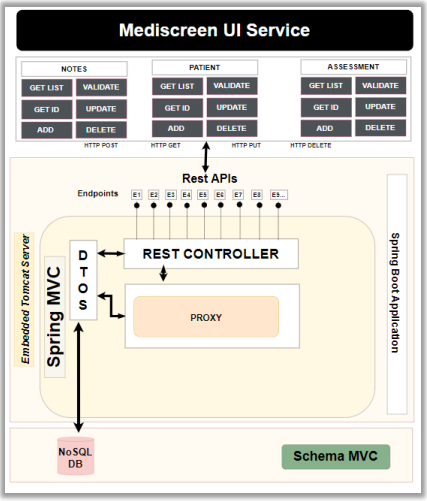
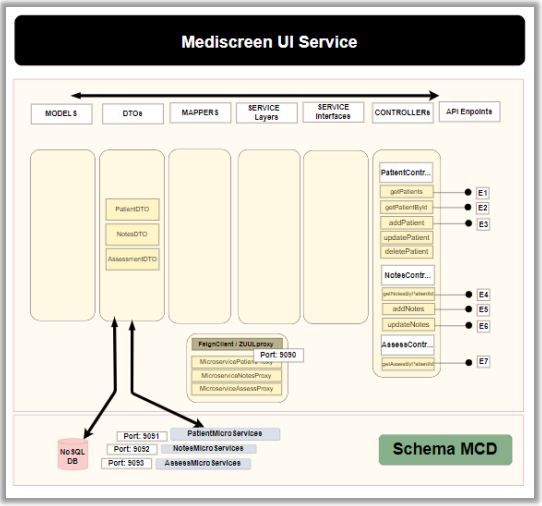
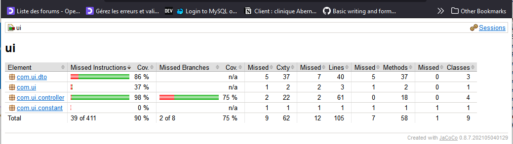
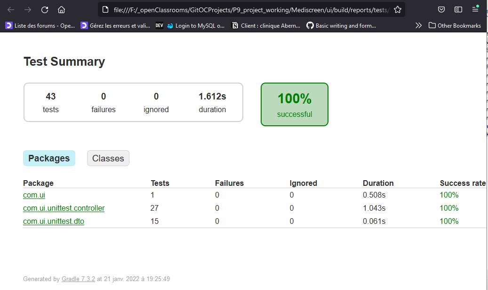
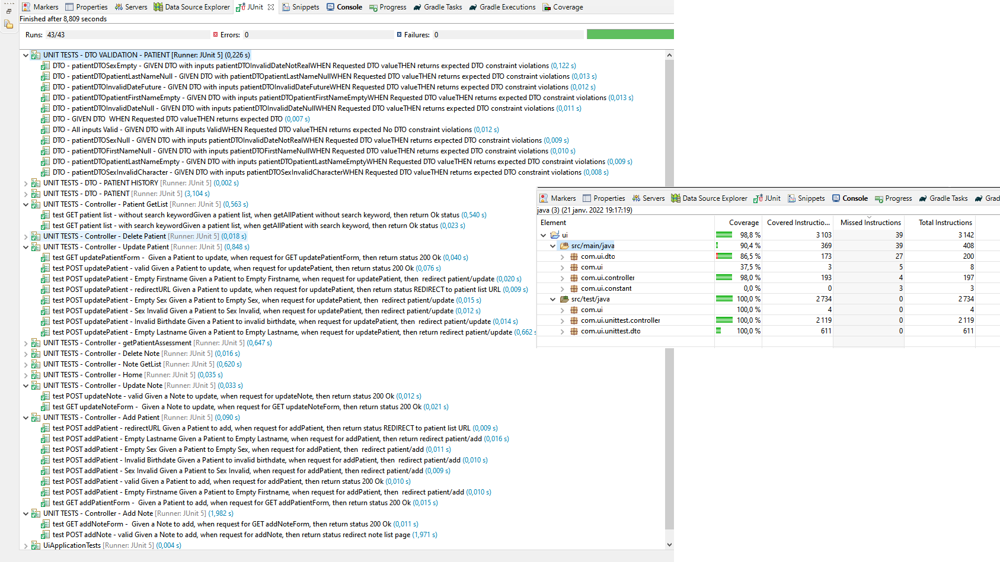
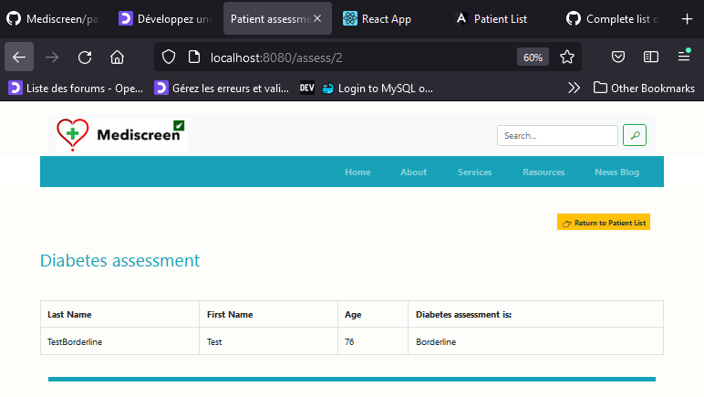
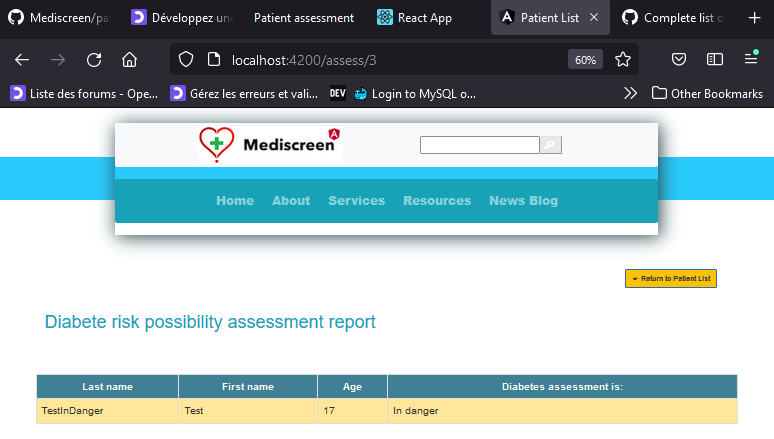
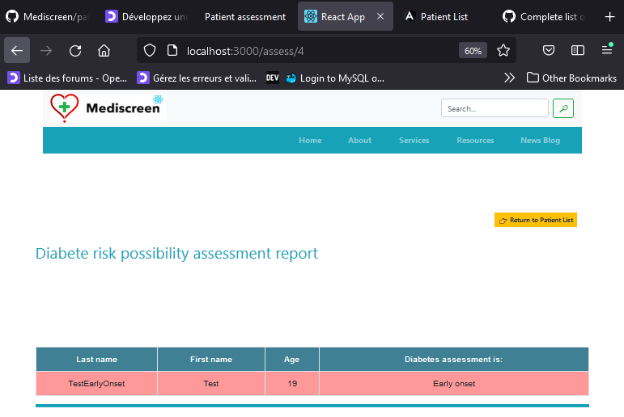
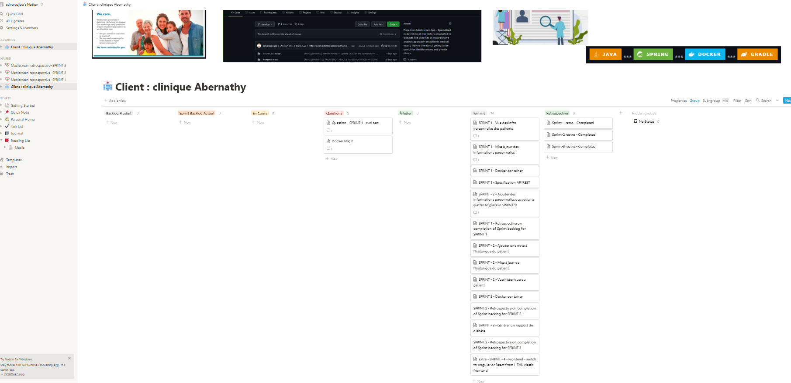
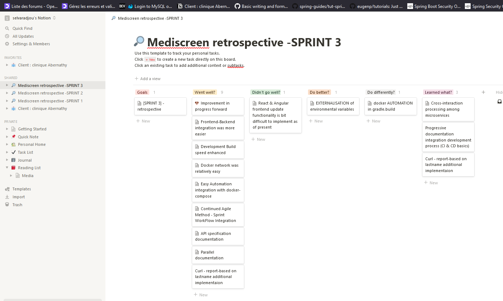

 ***  ***  *** 
<br><br><br>
<h1 align="center">Mediscreen - UI Frontend Microservice</h1><br><br>

**Mediscreen - UI Frontend Microservice** is developed with _Spring Boot adopting  _MVA_ design pattern and Test Design Approach (TDD).<br><br>
<br>

<a href="#"></a><br>
<br><br>

### Sprint I, II & III - goals:
- Integrate (**CRUD & Assessment Report Generation functionalities**) from the patient, patientHistory, patient Assessment microservices to establish the medical report for the patients to serve the application to facilitate global patient management service of clinics and health centers.<br><br>

### SPRINT I, II & III - tasks
- :heavy_check_mark: Implement  & Integrate PATIENT, PATIENT HISTORY & PATIENT ASSESSMENT REPORT generation functions to generate assessment report for patients and identify the vulnerability to diabetes risk level;
- :heavy_check_mark: Implement proxy configurations to the microservices interrelated to provide inputs from different microservices.
- :heavy_check_mark: Dependencies management, tests & test reports generation configurations using GRADLE build tool.
- :heavy_check_mark: Implement Dockerfile & docker-compose for patient UI frontend microservice.
- :heavy_check_mark: API documentation in support to the user stories & user test cases.
- :heavy_check_mark: Integration of backend with basic frontend like Thymeleaf.
- :heavy_check_mark: Agile KANBAN update of the sprint progress tracking (start date, anticipated deadline, completion date, tasks, task status...)
- :heavy_check_mark: Retrospective update at the end of each SPRINT
<br><br>

## Technological Spec & Run Prerequisites

- Java 11 JDK
- Gradle 7.3
- Docker 
<br><br><br>

## Architectural Spec - Microservice - UI frontend:

### Schema MVC

<a href="#"></a><br>
<br><br><br>


### Schema MCD

<a href="#"></a><br>
<br><br><br>


## Application Run configuration

 <br/>

```
gradle bootRun or ./gradle bootRun
```
```
gradle bootWar or ./gradle bootWar or ./gradle bootJar
```

<br><br>

 <br/>

### Building Docker images

Use the **Dockerfile** on the package roots containing individual 4 services to build docker images

SYNTAX:

```
docker build . -f Dockerfile -t imageNameToBeCreated
```

### Running a Docker image

Use the  **DockerImage** created above & run a Docker image using the command below

SYNTAX:

```
docker run -d -p HostPort:InternalAppPort --name dockerContainerNameToBeCreated -d DockerImageName
```

### Docker Compose

In case, if want to use an automated multi-container workflow with docker-compose, follow details below:

To deploy all Mediscreen microservices in a single go, use the **docker-compose.yml** on the package root containing all services that will orchestrate multiple containers wherein it will make it to work together based on the defined configuration in it. (Feel free to change the configuration settings for you required workflow)

SYNTAX:

```
docker-compose up -d
```
<br><br>


## Testing

Gradle, Junit (Unit & Integration Tests). <br/>

SYNTAX:

```
gradlew test or ./gradlew test or gradlew clean test
```


<br><br>

### JaCoCo coverage

<a href="#"></a><br>
<br>
<br>


### Gradle

<a href="#"></a><br>
<br>
<br>


### Junit 

<a href="#"></a><br>
<br>
<br>


## UI - UX frontend - Thymeleaf  


#### Patient assessment - GET http://localhost:8080/assess/2

<a href="#"></a><br>
<br><br>


## UI - UX frontend - Angular  


#### Patient assessment - GET http://localhost:4200/assess/3

<a href="#"></a><br>
<br><br>


## UI - UX frontend - React js  

#### Patient assessment - GET http://localhost:3000/assess/4

<a href="#"></a><br>
<br><br>


## API (Endpoints) documentation 

All endpoints are documented with POSTMAN and can be accessed launched with the below link to POSTMAN:


## SPRINT Backlog documentation (KANBAN @notion.io)

All SPRINT progress are documented with Notion.io and reported in the link below:


#### SPRINT I, II & III & IV - Completion (Angular + React)

<a href="#"></a><br>
<br><br>


[SPRINT progress documentation for this project](readme_docs/kanban_progressline_report/kanban_readme.md)

[NOTION - Backlog Online - Link](https://www.notion.so/411c45a75ebd41848f20816d5a1b023d?v=4fbc0f2adb024e93aea0306e875a9419)

<br><br>

<a href="https://www.notion.so/411c45a75ebd41848f20816d5a1b023d?v=4fbc0f2adb024e93aea0306e875a9419"></a><br>


## SPRINT Retrospective documentation

All SPRINT Retrospectives are documented reported here in the link below:

[SPRINT Retrospectives documentation for this project](https://github.com/selvaradjousk/Mediscreen/tree/develop/readme_docs/retrospectives)<br>
<br><br>
[SPRINT Retrospectives readme documentation for this project](https://github.com/selvaradjousk/Mediscreen/blob/develop/readme_docs/retrospectives/retro_readme.md)<br>
<br><br>

### SPRINT I, II & III - Retrospective

<a href="#"></a><br>
<br><br>


### SPRINT on Project Completion - Link below

<a href="https://www.notion.so/45e050d53f5d4e658660aef938390baf?v=38e546393141444596b10d2bcb8f7d82"></a><br>
<br><br>


## SPRINT Tasks timeline progress documentation

All Tasks timeline progress are documented and reported here in the link below:

[Tasks Timeline progress documentation](https://github.com/selvaradjousk/Mediscreen/commits/develop/readme_docs/project_progress_tracker.txt)<br>
<br><br>

### Authors
Mentee:  🡆   @Senthil<br>
Mentor:  🡆   Clément SEZETTRE<br><br>

<a href="https://www.linkedin.com/in/selvaradjou-senthil-kumar-6684131b3/"></a>&nbsp;&nbsp;
<a href="https://www.linkedin.com/in/sezettreclement/"></a>
<br>
<br>

### versions
Version:  🡆 1.0<br><br>

### License
@OpenClassrooms & @Mediscreen<br><br>
<a href="https://openclassrooms.com"></a><br>
<br><br>


### Reference Documentation
For further reference, please consider the following sections:

* [Official Gradle documentation](https://docs.gradle.org)
* [Spring Boot Gradle Plugin Reference Guide](https://docs.spring.io/spring-boot/docs/2.6.2/gradle-plugin/reference/html/)
* [Create an OCI image](https://docs.spring.io/spring-boot/docs/2.6.2/gradle-plugin/reference/html/#build-image)
* [Spring Boot DevTools](https://docs.spring.io/spring-boot/docs/2.6.2/reference/htmlsingle/#using-boot-devtools)
* [Validation](https://docs.spring.io/spring-boot/docs/2.6.2/reference/htmlsingle/#boot-features-validation)
* [Spring Data MongoDB](https://docs.spring.io/spring-boot/docs/2.6.2/reference/htmlsingle/#boot-features-mongodb)
* [Spring Boot Actuator](https://docs.spring.io/spring-boot/docs/2.6.2/reference/htmlsingle/#production-ready)
* [Spring Data JPA](https://docs.spring.io/spring-boot/docs/2.6.2/reference/htmlsingle/#boot-features-jpa-and-spring-data)
* [Rest Repositories](https://docs.spring.io/spring-boot/docs/2.6.2/reference/htmlsingle/#howto-use-exposing-spring-data-repositories-rest-endpoint)

* [Spring Web](https://docs.spring.io/spring-boot/docs/2.5.4/reference/htmlsingle/#boot-features-developing-web-applications)
* [Docker docs](https://docs.docker.com/)
* [Gradle User Manual](https://docs.gradle.org/current/userguide/userguide.html)
* [STAN DOCUMENTATION WHITE PAPER](http://stan4j.com/papers/stan-whitepaper.pdf) 


### Guides
The following guides illustrate how to use some features concretely:

* [Accessing Data with MongoDB](https://spring.io/guides/gs/accessing-data-mongodb/)
* [Building a RESTful Web Service with Spring Boot Actuator](https://spring.io/guides/gs/actuator-service/)
* [Accessing Data with JPA](https://spring.io/guides/gs/accessing-data-jpa/)
* [Accessing JPA Data with REST](https://spring.io/guides/gs/accessing-data-rest/)
* [Accessing Neo4j Data with REST](https://spring.io/guides/gs/accessing-neo4j-data-rest/)
* [Accessing MongoDB Data with REST](https://spring.io/guides/gs/accessing-mongodb-data-rest/)

* [Securing a Web Application](https://spring.io/guides/gs/securing-web/)
* [Building a RESTful Web Service](https://spring.io/guides/gs/rest-service/)
* [Serving Web Content with Spring MVC](https://spring.io/guides/gs/serving-web-content/)
* [Building REST services with Spring](https://spring.io/guides/tutorials/bookmarks/)
* [STAN Structure Analysis for Java](http://stan4j.com/)

### Additional Links
These additional references should also help you:

* [Gradle Build Scans – insights for your project's build](https://scans.gradle.com#gradle)

